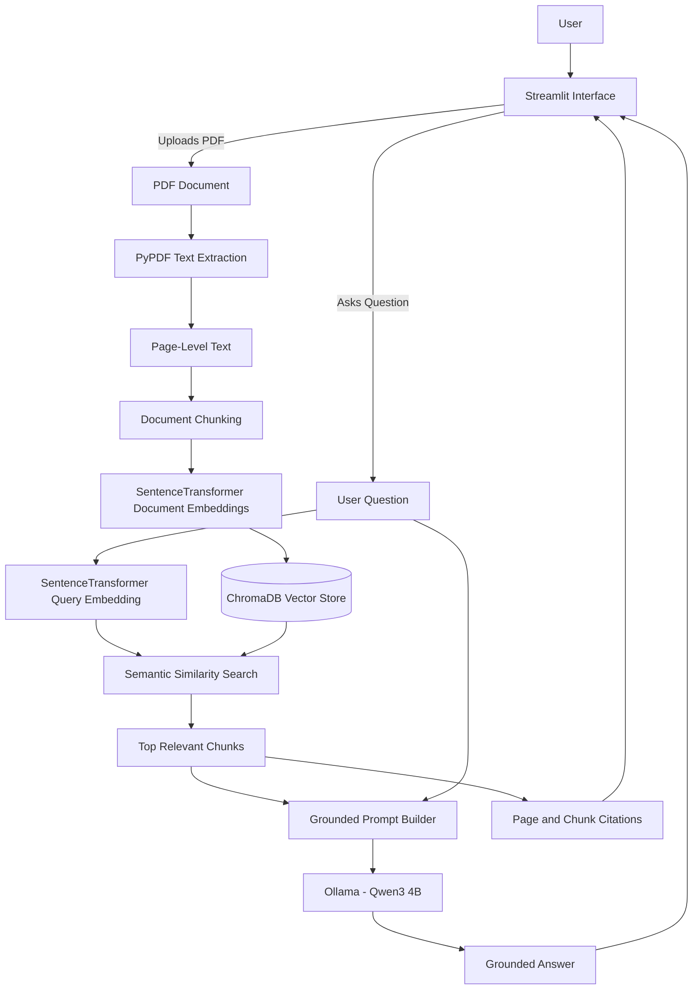

# Smart Document Q&A

A local Retrieval-Augmented Generation application that lets users upload a PDF, ask natural-language questions, and receive grounded answers with page and chunk citations.

The application uses local embeddings, ChromaDB vector search, and an Ollama-hosted language model, allowing the core workflow to run without paid API access.

---

## Project Overview

People often have useful information trapped inside long PDFs, reports, notes, manuals, and research documents.

Searching manually through these documents can be slow and inefficient.

Smart Document Q&A solves this problem by turning a text-based PDF into a searchable knowledge source.

The system:

1. Extracts text from the uploaded PDF
2. Splits the document into overlapping chunks
3. Converts each chunk into an embedding
4. Stores the embeddings in ChromaDB
5. Retrieves relevant passages for each question
6. Generates a grounded answer using a local language model
7. Displays the answer with supporting page and chunk citations

---

## Screenshots

### Upload and Configuration


### Processed Document


### Grounded Answer


### Source Citations


---

## Key Features

* Upload and process text-based PDF documents
* Extract text while preserving page metadata
* Divide documents into configurable overlapping chunks
* Generate local document and query embeddings
* Store and search vectors with ChromaDB
* Retrieve semantically relevant passages
* Generate grounded answers through Ollama
* Display page, chunk, and similarity information
* Maintain Streamlit chat history
* Detect when a different PDF is uploaded
* Clear conversations without reprocessing the document
* Reset the active document and vector state
* Refuse unsupported questions when the answer is not in the retrieved context
* Remove reasoning-model thinking text from user-facing responses
* Support OpenAI as an optional provider
* Run automated unit and RAG evaluation tests

---

## Architecture



A more detailed explanation is available in:

[View the architecture documentation](docs/architecture.md)

---

## Technology Stack

| Component             | Technology                               |
| --------------------- | ---------------------------------------- |
| Programming language  | Python                                   |
| User interface        | Streamlit                                |
| PDF extraction        | PyPDF                                    |
| Embeddings            | SentenceTransformers                     |
| Embedding model       | `sentence-transformers/all-MiniLM-L6-v2` |
| Vector database       | ChromaDB                                 |
| Local model runtime   | Ollama                                   |
| Answer model          | `qwen3:4b`                               |
| Optional provider     | OpenAI                                   |
| Environment variables | python-dotenv                            |
| Testing               | pytest                                   |

---

## RAG Processing Flow

```text
PDF Upload
    ↓
Text Extraction
    ↓
Page-Level Metadata
    ↓
Overlapping Document Chunks
    ↓
SentenceTransformer Embeddings
    ↓
ChromaDB Vector Storage
    ↓
User Question
    ↓
Query Embedding
    ↓
Semantic Similarity Search
    ↓
Top Relevant Chunks
    ↓
Grounded Prompt
    ↓
Local Ollama Answer
    ↓
Answer with Sources
```

---

## Project Structure

```text
smart-doc-qa/
├── app.py
├── assets/
│   ├── 01-upload-screen.png
│   ├── 02-processed-document.png
│   ├── 03-grounded-answer.png
│   └── 04-source-citations.png
├── docs/
│   └── architecture.md
├── evals/
│   └── playbook_cases.json
├── prompts/
│   └── rag_answer.txt
├── sample_docs/
├── scripts/
│   └── run_evaluation.py
├── src/
│   ├── __init__.py
│   ├── chat.py
│   ├── chunking.py
│   ├── citations.py
│   ├── embeddings.py
│   ├── evaluation.py
│   ├── ingestion.py
│   ├── qa_chain.py
│   └── retriever.py
├── tests/
│   ├── test_chat.py
│   ├── test_chunking.py
│   ├── test_citations.py
│   ├── test_embeddings.py
│   ├── test_evaluation.py
│   ├── test_ingestion.py
│   ├── test_qa_chain.py
│   ├── test_retriever.py
│   └── test_similarity_search.py
├── .env.example
├── .gitignore
├── pytest.ini
├── README.md
└── requirements.txt
```

---

## Local Installation

### 1. Clone the repository

```bash
git clone https://github.com/Sulav-17/smart-doc-qa.git
cd smart-doc-qa
```

### 2. Create a virtual environment

Windows PowerShell:

```powershell
python -m venv .venv
.\.venv\Scripts\Activate.ps1
```

### 3. Install dependencies

```powershell
python -m pip install --upgrade pip
pip install -r requirements.txt
```

### 4. Install the local Ollama model

Install Ollama on your computer, then run:

```powershell
ollama pull qwen3:4b
```

Confirm that the model is available:

```powershell
ollama list
```

### 5. Configure environment variables

Create a private `.env` file in the project root:

```text
AI_PROVIDER=local
EMBEDDING_PROVIDER=local

LOCAL_EMBEDDING_MODEL=sentence-transformers/all-MiniLM-L6-v2

OLLAMA_BASE_URL=http://localhost:11434
OLLAMA_MODEL=qwen3:4b
```

Do not commit the `.env` file.

### 6. Run the application

```powershell
streamlit run app.py
```

The application should open in your browser.

---

## How to Use

1. Upload a text-based PDF.
2. Select the chunk size and chunk overlap.
3. Choose how many sources should be retrieved for each answer.
4. Click **Process document**.
5. Wait while the document is extracted, chunked, embedded, and stored.
6. Ask a question through the chat interface.
7. Expand **View sources** to inspect the retrieved passages.
8. Use **Clear conversation** to remove messages while keeping the document.
9. Use **Reset document** to process a different PDF.

Recommended starting settings:

```text
Chunk size: 1000
Chunk overlap: 200
Sources per answer: 5
```

---

## Running the Tests

Run the complete unit-test suite:

```powershell
python -m pytest
```

The tests cover:

* PDF extraction
* Document chunking
* Embedding generation
* Vector storage
* Similarity search
* Prompt construction
* Local and optional API answer generation
* Source formatting
* Chat-state helpers
* Abstention behavior
* Evaluation helpers
* Removal of model thinking text

---

## RAG Evaluation

The project includes an end-to-end evaluation dataset covering:

* Supported factual questions
* Paraphrased questions
* Expected source pages
* Unsupported questions
* False-premise questions
* Hallucination-refusal behavior

Place an evaluation PDF inside `sample_docs/`, then run:

```powershell
python scripts/run_evaluation.py --pdf "sample_docs/Build With AI Playbook.pdf" --top-k 6
```

The evaluation pipeline:

1. Processes the complete PDF
2. Creates a temporary evaluation vector database
3. Runs each predefined question
4. Retrieves relevant passages
5. Generates a local answer
6. Checks expected answer or abstention behavior
7. Checks whether expected pages were retrieved
8. Prints a final evaluation summary

Automated checks provide a repeatable baseline, but retrieved passages and generated answers should still be reviewed manually.

---

## Grounding and Hallucination Reduction

The application uses several controls to reduce unsupported answers:

* The language model receives only retrieved document passages
* The prompt prohibits outside knowledge
* Unsupported questions use a standard abstention response
* Empty retrieval results immediately return an abstention
* Source passages are displayed below every generated answer
* Page and chunk metadata are preserved
* Model temperature is set to zero for consistent local responses
* Hidden reasoning text is removed from the final answer
* Evaluation cases test unrelated and misleading questions

Required abstention response:

```text
I do not know based on the provided document.
```

---

## Current Limitations

* Only one PDF is active at a time
* The PDF must contain selectable text
* Image-only and scanned PDFs require OCR, which is not currently included
* Complex tables and diagrams may not extract perfectly
* Retrieval quality depends on chunk size, overlap, and source count
* Local answer speed depends on the computer’s CPU, memory, and model-loading time
* Chat messages are stored during the session, but previous messages are not yet used as conversational context
* The public demo is not currently deployed because the answer model runs through local Ollama

---

## Future Improvements

* Upload and search across multiple PDFs
* Add OCR for scanned documents
* Add hybrid keyword and vector retrieval
* Add reranking before answer generation
* Add conversation-aware follow-up questions
* Add document names to citations
* Add retrieval-confidence thresholds
* Add downloadable chat histories
* Add user authentication
* Add persistent document libraries
* Add a hosted public demo
* Add response-time and retrieval-quality dashboards
* Compare multiple embedding and answer models

---

## What I Learned

This project demonstrates practical experience with:

* Retrieval-Augmented Generation
* Document ingestion pipelines
* PDF text extraction
* Chunking strategies
* Embedding models
* Vector databases
* Semantic search
* Prompt grounding
* Hallucination reduction
* Source attribution
* Local language-model inference
* Provider abstraction
* Streamlit state management
* Unit testing
* RAG evaluation
* Git and GitHub workflows

---

## Privacy

The default local configuration processes document text through locally running components:

* SentenceTransformers generates embeddings locally
* ChromaDB stores vectors locally
* Ollama generates answers locally

Uploaded files and document contents are not intentionally sent to a paid external model when the application is configured for local providers.

Users should still avoid uploading sensitive documents to an unknown or publicly hosted deployment.

---

## Author

**Sulav Baral**

Built as part of an AI engineering portfolio focused on practical, end-to-end applications.
