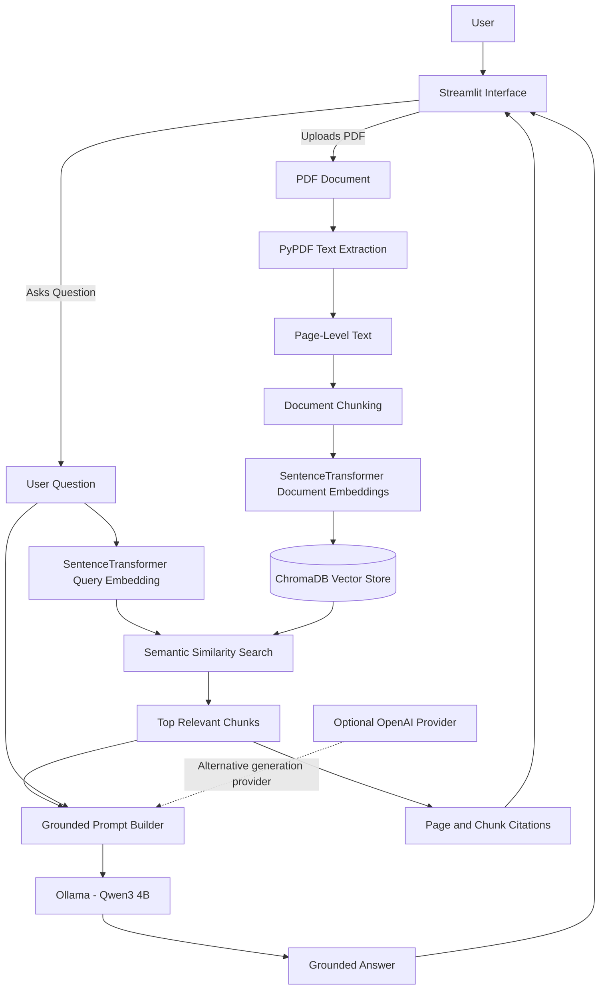

# Smart Document Q&A Architecture

## Processing Flow

1. The user uploads a text-based PDF through Streamlit.
2. PyPDF extracts text while preserving page metadata.
3. The text is divided into overlapping chunks.
4. SentenceTransformers converts each chunk into a numerical embedding.
5. ChromaDB stores the embeddings and document metadata.
6. The user's question is converted into a query embedding.
7. ChromaDB retrieves the most semantically similar chunks.
8. The retrieved chunks and question are inserted into a grounded prompt.
9. Ollama generates an answer using the local Qwen3 model.
10. The application displays the answer with page and chunk sources.

## Default Local Stack

- **Interface:** Streamlit
- **PDF extraction:** PyPDF
- **Embedding model:** `sentence-transformers/all-MiniLM-L6-v2`
- **Vector database:** ChromaDB
- **Answer model:** Ollama with `qwen3:4b`
- **Testing:** pytest

## Optional Provider

The application supports OpenAI as an optional alternative answer-generation provider through environment configuration.